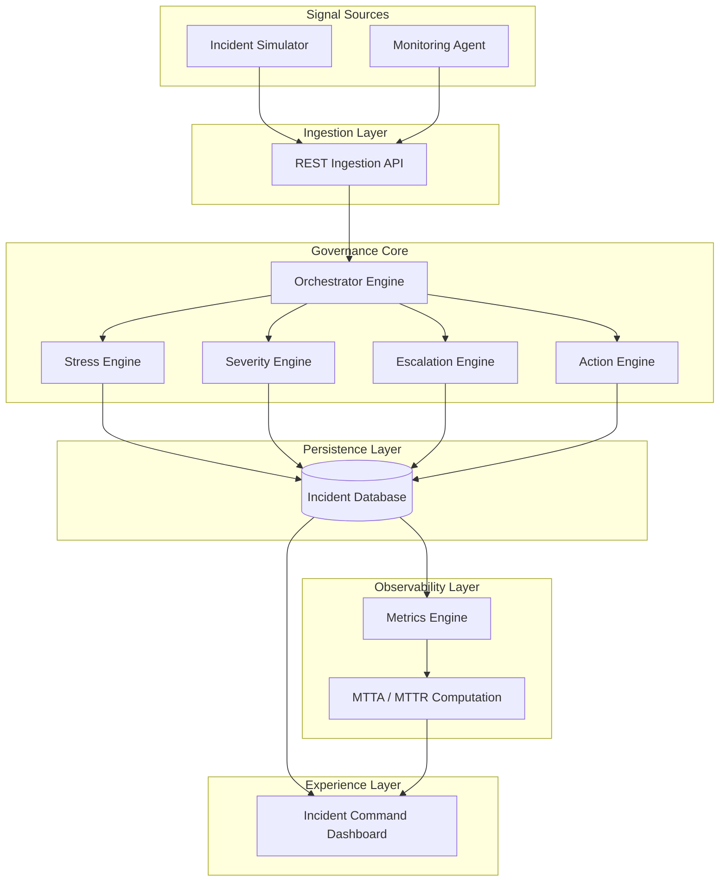

🚨 Autonomous Incident Governance Platform

A backend-driven Incident Governance Platform designed to transform monitoring signals into severity-aware operational decisions with automated escalation detection, lifecycle governance, and real-time SRE metric tracking (MTTA / MTTR).

📌 Problem Statement

Modern monitoring systems generate excessive alerts without operational context, making it difficult for teams to:

Prioritize incidents effectively

Detect escalation risk early

Measure response efficiency

🎯 Our Solution

This platform introduces a governance layer that:

Processes incident signals via REST ingestion

Infers severity using stress-based logic

Detects escalation thresholds automatically

Tracks lifecycle states (OPEN → ACK → RESOLVED)

Computes operational KPIs like MTTA and MTTR

Provides a centralized incident command dashboard

🏗️ System Architecture

⚡ Tech Stack

Backend: Django, Django REST Framework

Database: SQLite (PostgreSQL-ready architecture)

Frontend: Django Templates + Chart.js

Architecture: Modular decision engines (core/)

API Design: REST-based ingestion & metrics exposure

📡 API Endpoints
Endpoint	Purpose
/api/incident/	Incident ingestion
/api/metrics/	Operational metrics
/dashboard/	Visualization UI
🚀 Future Scope

Real-time streaming ingestion (Kafka / Redis)

Alert notification integrations (Slack / Email)

ML-based severity inference

Microservice decomposition

Cloud-native deployment

📊 Demo Flow

Incident signal generated via ingestion API

Decision engines infer severity and escalation risk

Incident stored and lifecycle initiated

Metrics computed and visualized on dashboard

Operators acknowledge and resolve incidents

💡 Impact

Reduces alert fatigue

Introduces severity-aware decision making

Enables measurable operational response performance

Simulates an SRE-inspired incident command center
