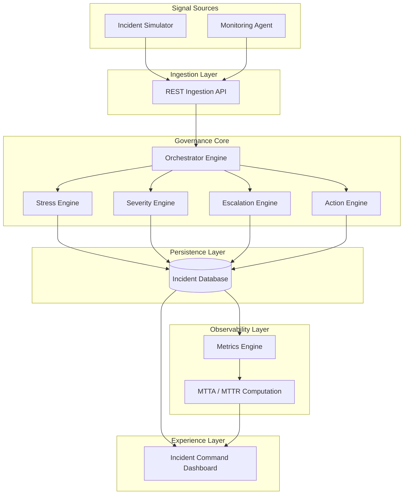

## 🚨 Autonomous Incident Governance Platform

A backend-centric Incident Governance Platform that ingests monitoring signals via REST APIs and applies modular decision engines to infer severity, detect escalation risk, orchestrate lifecycle states, and compute real-time SRE reliability metrics (MTTA / MTTR).
## 📌 Problem Statement

Modern IT environments rely heavily on monitoring and observability tools to detect infrastructure failures, performance degradation, and service disruptions. While these systems generate large volumes of alerts, they often lack operational context, prioritization logic, and coordinated response mechanisms.

As a result, engineering and SRE teams face significant challenges in managing incidents effectively, especially in high-alert environments where multiple signals compete for attention.

The challenge lies in:

1. **Alert Fatigue:** Continuous streams of alerts make it difficult for teams to distinguish critical incidents from low-impact noise.  
2. **Lack of Severity Intelligence:** Most monitoring tools detect anomalies but do not infer business or operational severity.  
3. **Delayed Escalation Awareness:** Without automated escalation detection, incidents may silently degrade before receiving appropriate attention.  
4. **Fragmented Lifecycle Tracking:** Incident states (OPEN → ACK → RESOLVED) are often managed across tools, reducing governance visibility.  
5. **Limited Response Metrics:** Teams struggle to measure operational efficiency due to missing MTTA and MTTR insights.  

These gaps highlight the need for a dedicated governance layer that transforms raw monitoring signals into actionable incident intelligence and measurable operational decisions.

## 🎯 Our Solution

This platform introduces a governance layer that:

1. Processes incident signals via REST ingestion  
2. Infers severity using stress-based logic  
3. Detects escalation thresholds automatically  
4. Tracks lifecycle states (**OPEN → ACK → RESOLVED**)  
5. Computes operational KPIs like **MTTA and MTTR**  
6. Provides a centralized incident command dashboard  

**🏗️ System Architecture
**

## ⚡ Tech Stack

- **Backend:** Django, Django REST Framework  
- **Database:** SQLite *(PostgreSQL-ready architecture)*  
- **Frontend:** Django Templates + Chart.js  
- **Architecture:** Modular decision engines (`core/`)  
- **API Design:** REST-based ingestion & metrics exposure
  

**📡 API Endpoints**
| Endpoint         | Purpose             |
| ---------------- | ------------------- |
| `/api/incident/` | Incident ingestion  |
| `/api/metrics/`  | Operational metrics |
| `/dashboard/`    | Visualization UI    |

## 🚀 Future Scope

- Real-time streaming ingestion *(Kafka / Redis)*  
- Alert notification integrations *(Slack / Email)*  
- ML-based severity inference  
- Microservice decomposition  
- Cloud-native deployment  

---

## 📊 Demo Flow

1. Incident signal generated via ingestion API  
2. Decision engines infer severity and escalation risk  
3. Incident stored and lifecycle initiated  
4. Metrics computed and visualized on dashboard  
5. Operators acknowledge and resolve incidents  

---

## 💡 Impact

- Reduces alert fatigue  
- Introduces severity-aware decision making  
- Enables measurable operational response performance  
- Simulates an SRE-inspired incident command center 
